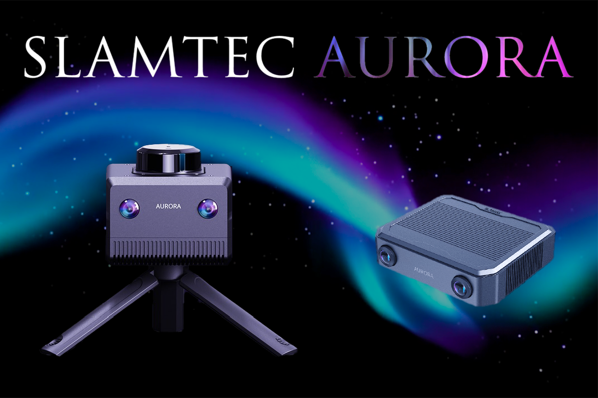
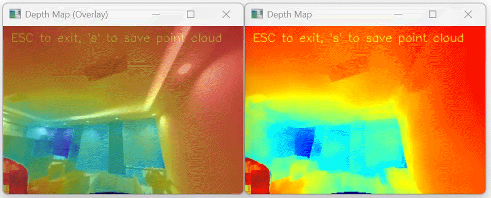
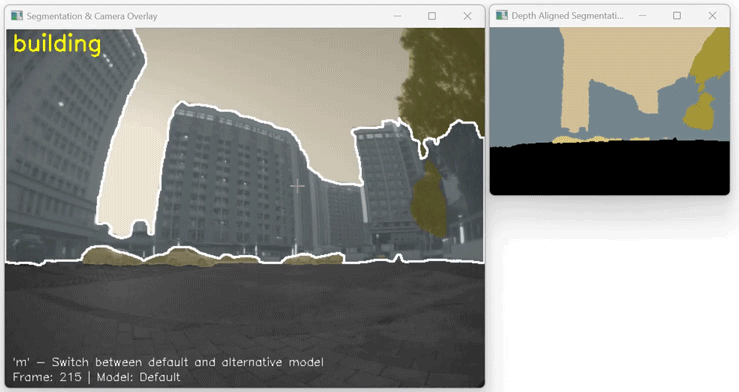

# SLAMTEC Aurora Remote SDK and Demo

([中文版点此](README.zh-CN.md))




This repository contains the Demo code and project skeleton for using the SLAMTEC Aurora Remote SDK.


## Prerequisites
- SLAMTEC Aurora Device
- WiFi or Ethernet connection between the device and the host machine

## Prerequisites for Building
- CMake 3.12 or above
- C++14 Compiler (gcc 7.5 or above, MSVC 2019 or above, clang 8 or above)
- Pure C can be compiled with any C compiler that supports C11 (but C++ wrapper is not supported)
- OpenCV 4.2 or above (if you want to compile the demo that uses OpenCV)

## ROS Integration
- SLAMTEC provides Aurora ROS wrapper nodes for [ROS](https://github.com/Slamtec/aurora_ros) and [ROS2](https://github.com/Slamtec/aurora_ros/tree/ros2).
- You can find the wrapper nodes on SLAMTEC Aurora Website. ([ROS Wrapper Nodes](https://developer.slamtec.com/docs/slamware/aurora_ros2_sdk_en/))
- Some Aurora specific features are not supported in the ROS wrapper nodes, such as the auto floor detection.
- If you want to use the Aurora specific features, you need to use the Remote SDK.


## Have you tried the SLAMTEC Official Tool?
We are highly recommend you to use the SLAMTEC Official Tool first for better evaluation and development experience.
- Aurora Remote App


They can be downloaded from the following links:
- [SLAMTEC Aurora Website](https://www.slamtec.com/en/Aurora) / ([中文版点此](https://www.slamtec.com/cn/Aurora))

## API Reference of the Remote SDK
- [Remote SDK API Reference](doc/html/index.html)
This is the API reference for the Remote SDK. It contains the function prototypes, parameter descriptions, and return values for all the functions in the Remote SDK.


## Steps to build the Demos
1. Clone the repository and its submodules:
    ```
    git clone --recurse-submodules https://github.com/Slamtec/aurora_remote_sdk_demo.git
   
2. (optional) Install the dependencies for the demo that uses OpenCV:
  
   e.g. on Ubuntu:
   ```
   sudo apt-get install -y libopencv-dev
   ```

3. Build the demos with CMake.

    ```
    # navigate to source directory
    mkdir build
    cd build
    cmake ..
    make
    ```
4. Run the demo.


## How to deploy the SDK on target machines
- The precompiled libraries only depend on the C++ standard library, so it can be deployed on any machine that supports C++14.
- For Linux platforms, also make sure the glibc version is 2.31 or above.
- For MacOS platforms, only apple silicon based machines (M1/M2/M3 etc.) are supported.

## About the Demos

### Core Functionality Demos

#### simple_pose
- Basic demo showing how to retrieve device pose (position and orientation).
- [📖 Detailed README](demo/simple_pose/README.md)

#### relocalization  
- Demonstrates how to trigger relocalization to establish device position in a known map.
- [📖 Detailed README](demo/relocalization/README.md)

#### pure_c_demo
- Pure C implementation without C++ wrapper dependencies.
- [📖 Detailed README](demo/pure_c_demo/README.md)

### Enhanced Imaging Demos (SDK 2.0)

#### depthcam_view

- Depth camera visualization with 3D point cloud export capabilities.
- Requires OpenCV.
- [📖 Detailed README](demo/depthcam_view/README.md)

#### semantic_segmentation

- Real-time semantic segmentation with interactive visualization and model switching.
- Requires OpenCV.
- [📖 Detailed README](demo/semantic_segmentation/README.md)

### Sensor Data Demos

#### imu_fetcher
- Real-time IMU (accelerometer and gyroscope) data retrieval and display.
- [📖 Detailed README](demo/imu_fetcher/README.md)

#### frame_preview

- Captures and displays tracking frames and raw stereo camera images.
- Requires OpenCV.
- [📖 Detailed README](demo/frame_preview/README.md)

#### lidar_scan_plot
  
- Real-time LiDAR scan visualization with distance and quality data.
- Requires OpenCV.
- [📖 Detailed README](demo/lidar_scan_plot/README.md)

### Mapping and Visualization Demos

#### map_render

- Renders VSLAM map data including keyframes and map points.
- Requires OpenCV.
- [📖 Detailed README](demo/map_render/README.md)

#### lidar_2dmap_render

- Generates and visualizes 2D occupancy grid maps from LiDAR data.
- Requires OpenCV.
- [📖 Detailed README](demo/lidar_2dmap_render/README.md)

#### vslam_map_saveload
- Command-line tool for downloading/uploading VSLAM maps to/from devices.
- [📖 Detailed README](demo/vslam_map_saveload/README.md)


### Calibration and Device Info Demos (SDK 2.0)

#### calibration_exporter
- Command-line tool for exporting camera and transform calibration data.
- Requires OpenCV.
- [📖 Detailed README](demo/calibration_exporter/README.md)

#### device_info_monitor
- Real-time monitoring of device basic information and status.
- [📖 Detailed README](demo/device_info_monitor/README.md)

### Dataset Recording Demos (SDK 2.0)

#### colmap_recorder
- Records COLMAP-compatible datasets for Structure-from-Motion and 3D reconstruction.
- Configurable recording options including image quality, file formats, and processing parameters.
- Supports stereo recording, image undistortion, and various output formats.
- [📖 Detailed README](demo/colmap_recorder/README.md)